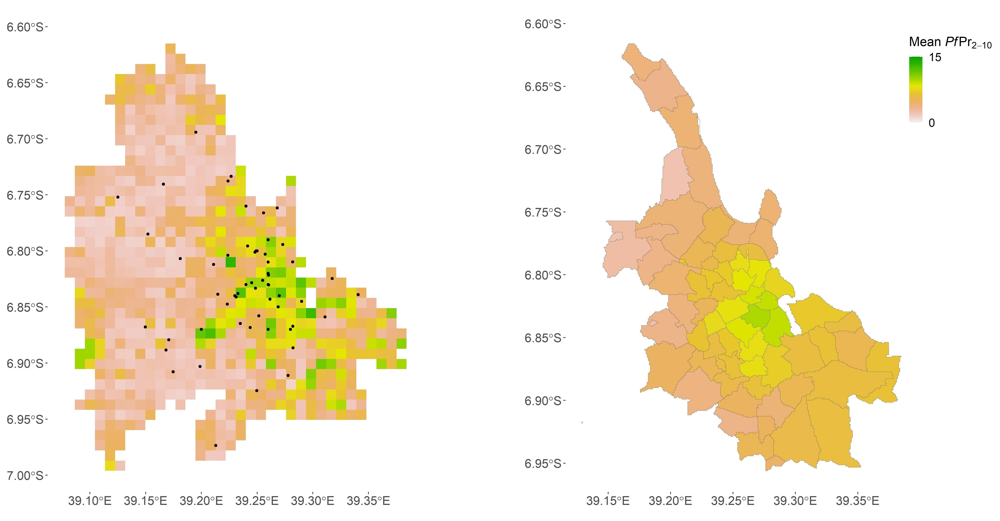

# Malaria risk mapping in sub-Saharan African cities using environmental and socio-economic predictors 

This repository contains data and material to model and predict malaria risk (measured as *Pf*PR<sub>2-10</sub>) in four sub-Saharan African cities, Dakar (Senegal), Ouagadougou (Burkina Faso), Kampala (Uganda) and Dar es Salaam (Tanzania), using a set of environmental and socio-economic predictors derived from remote sensing imagery. These predictors are multi-resolution variables depicting the urban climate, the land use and the land cover. *Pf*PR<sub>2-10</sub> modelling and prediction are achieved using a popular machine learning algorithm, namely random forest (RF). 

Malaria prevalence data come from various types of surveys, many of which are Demographic and Health Surveys (DHS) in which the urban cluster coordinates are randomly displaced within 2 km buffers to protect the privacy of the participants. Although it has little impact at the national scale, at the intra-urban scale it decreases the spatial accuracy of the DHS indicators and in turn affects the predictive performance of malaria models. The modelling workflow proposed here allows to use and test spatial optimisation methods to reduce the effect of DHS displacement on model predictive performance, as used <!--in XX to model *Pf*PR<sub>2-10</sub> or --> in [Georganos *et al.*, 2019](#1) to model the DHS wealth index. These methods are based on the duplication of the released DHS coordinates in the four cardinal directions (N, S, E, W) in order to enrich or refine the contextual spatial feature extraction.  

Fore more information on the data and material presented here see [Morlighem *et al.*, 2022](#2). <!-- and XX  -->


## Data 

### Malaria prevalence data 

Malaria prevalence data (see folder `Data\Malaria_data\`) come from an open online malaria database recording survey data from several sources [[4](#4)], such as scientific papers or DHS. The prevalence is measured as the *Plasmodium falciparum* Parasite Rate (i.e. the proportion of people infected by *Pf*) standardised over the two-to-ten age range (*Pf*PR<sub>2-10</sub>) [[5](#5)]. 

### Geospatial datasets

The following geospatial datasets (see folder `Data\Variables\`) are used as covariates for modelling and mapping *Pf*PR<sub>2-10</sub> : 

* COSMO-CLM variables (`COSMO`) : COSMO-CLM variables are 1 km resolution raster grids produced by the COSMO-CLM model. They represent different climate variables as aggregate values (average, maximum or minimum) for the dry season (June to September 2014) [[6](#6)]. Note that this dataset is only available for Dar es Salaam and Kampala. 
* Climatic variables (`CLIMATIC`) : This dataset can be used as a substitute to the COSMO-CLM variables when working on the cities of Dakar and/or Ouadougou. It includes aggregates (mean, maximum or minimum) of year-monthly day and night Land Surface Temperatures from MODIS data collections (products MYD11A1 v006 and MOD11A1 v006) at 1 km resolution over a 13-year period (2005-2017) [[7](#7)-[8](#8)]. It also includes aggregates of year-monthly precipitation and windspeed over 1970-2000 from WorldClim climatic data (1 km resolution) [[9](#9)].
* Local climate zones (`LCZ`) : LCZ maps are binary maps of 100 m resolution classifying pixels into areas of uniform surface cover and structure with a specific temperature regime [[10](#10)]. They were derived applying a random forest (RF) classification algorithm to Landsat, USGS and Sentinel imagery from 2017 to 2019 [[11](#11)-[12](#12)]. 
* Land use and land cover (`LULC`) : LC maps (0.5 m resolution) were derived from Pleiades satellite images acquired in 2013 for Kampala and in 2016 and 2018 for Dar es Salaam. The LC classification was performed using Computer Assisted Photo Interpretation, GEOBIA and machine learning [[13](#13)]. The LU maps (20 m resolution) were produced based on the LC maps and linear information extracted from OpenStreetMap [[14](#14)].
* Ancillary variables (`BASE`): These are (i) the averaged NDVI and NDWI over period 2005-2019 derived from Landsat 5 and 8 satellite imagery (100 m resolution) and (ii) a SRTM digital elevation model of 2000 (30 m resolution) [[6](#6)].

Note that for downloading some of these data from this repository, you need [Git Large File Storage (LFS)](https://git-lfs.com/) installed. 


### Other data

Besides malaria prevalence data and geospatial datasets, mapping *Pf*PR<sub>2-10</sub> requires a <a id="predgrid"></a>prediction grid of 1 km resolution (see folder `Data\Prediction_grid\`) covering the city extents and (optionally) maps of the administrative boundaries (admin levels 4 and 5) of the cities (see folder `Data\Admin\`). 

## Material 

### Installing dependencies 

To run this code, you need a recent version of R (R 4.1+). Required R packages can be installed in R or R Studio with: 

```r
install.packages(c("spex", "sf", "sp", "raster", "stars", "XLConnect", "foreach", "dplyr", "plyr", "exactextractr", "doParallel", "iterators", "units", "corrplot", "ggplot2", "ggpubr", "mlr", "parallelMap", "pdp", "tibble", "purrr", "ggspatial", "ggsn", "pracma", "rgdal", "tidyr", "tidyverse", "stringr"))
```
Note that this code was developed using Windows and was not tested with macOS.

### Running the code

The whole process of modelling and mapping *Pf*PR<sub>2-10</sub> in Dakar, Ouagadougou, Kampala and Dar es Salaam can be implemented by running the main script `Scripts\main_MRM.R`, which performs for each city the following steps : 

#### 1. Select malaria prevalence surveys

Through function `select.malaria.data`, the code selects surveys in the [database](#malaria-prevalence-data) (1) that were conducted over the 2005-2016 period, and (2) that only include participants younger than 16 years old. You can change the following parameters for selecting malaria surveys : 

* `max_age` : integer defining maximum age of survey participants
* `survey_date` : vector with two integers respectively defining the start and end years of the considered time period
* `select_DHS` : boolean defining whether to select DHS or not 


#### 2. Extract covariates 

Using function `covariates.extraction`, covariates are extracted for the different input [geospatial datasets](#geospatial-datasets) either directly at the survey coordinates for 1 km resolution variables or in 1 km buffers for finer resolution variables. In addition, for a latter prediction stage, covariates are extracted for all pixel centroids of the 1 km resolution [prediction grid](#predgrid) covering the city extent. With the following parameter, you can choose whether to implement covariates extraction for the training and/or prediction stages: 

* `cov_extract_aims` : vector with `"training"` and/or `"prediction"` as elements

Optionally, you can use function `check.correlation` to create correlation matrices and check the correlation between all covariates and *Pf*PR<sub>2-10</sub>. 

#### 3. Create random forest (RF) models

*Pf*PR<sub>2-10</sub> is modeled using RF modelling via the function `rf.modelling`. RF models are built using a 10-repeated 5-fold spatial cross-validation (SCV) with 2 sub-folds for tuning the hyperparameters. Variable selection is implemented using a Recursive Feature Elimination. You can change the following parameters for RF modelling: 

* `reps`, `folds`, `iters` : integers defining the number of repetitions, folds and sub-folds in the SCV 


#### **Optional** : spatial optimisation methods

Spatial optimisation can be tested to reduce the effect of DHS displacement on model predictive performance. These methods work by creating duplicates of the released DHS data-points in the four cardinal directions (N, S, E, W) at 500 metres and 1000 metres (using function `generate.duplicates`). Covariates are extracted for these duplicates (using function `covariates.extraction` with argument `method` set to `"m1"` or `"m2"`), keeping the same *Pf*PR<sub>2-10</sub> value as the original DHS data-point. Two spatial optimisation methods are then proposed : 

* `m1` : M1 enriches the spatial feature extraction by using all the duplicates for RF modelling 
* `m2` : M2 refines the spatial feature extraction by selecting the best set of duplicates over 1000 iterations where the data-points used for RF modelling are randomly selected 

These methods can be incorporated into the RF modelling setting `method = "m1"` or `method = "m2"` in function `rf.modelling`. Note that the default for this argument is`"m0"`, which is the base RF modelling method implemented without spatial optimisation. 

#### 4. Predict *Pf*PR<sub>2-10</sub>
 
Function `rf.prediction` is used to predict *Pf*PR<sub>2-10</sub> at 1 km resolution using the [prediction grid](#predgrid). The final predictive map is the average of the predictions made by the 50 models built in SCV (10 repetitions * 5 folds). Additional maps are created by aggregating the *Pf*PR<sub>2-10</sub> predictions by administrative boundaries. The following can be changed by the user : 

* `method` : character defining the type of spatial optimisation method to be used for predictions (`"m0"`, `"m1"` or `"m2"`)


#### Additional functionalities 

In addition to modelling and mapping *Pf*PR<sub>2-10</sub> in Dakar, Ouagadougou, Kampala and Dar es Salaam (`Scripts\main_MRM.R`), other functionalities are also provided : 

* **Dataset comparison** : `Scripts\compare_dataset.R` allows to compare the importance of different [geospatial datasets](#geospatial-datasets) for modelling *Pf*PR<sub>2-10</sub>, i.e. BASE, LULC, LCZ and COSMO variables, as done in [Morlighem *et al.*, 2022](#2).
* **Simulation study**: `Scripts\simulation_study.R` tests spatial optimisation methods with simulated data<!--, as done in XX -->. Non-DHS data from Dar es Salaam are randomly displaced according to the DHS procedure, and used to model *Pf*PR<sub>2-10</sub> using spatial optimisation methods. Predictive performance of these models is then compared to predictive performance of models trained with the original non-displaced data. 


## Results

Running this code creates a `Results` folder with four subfolders : (1) `Malaria_data`, (2) `Covariates`, (3) `RF_modelling` and (4) `Prediction`, which respectively contain the results of the four steps previously described. Interesting outputs are : 

* `Malaria_data\<city>\malaria_data_<city>.shp` : a shapefile storing the selected malaria surveys and their attributes 
* `Malaria_data\<city>\duplicates\malaria_data_<city>.shp` : a shapefile storing the **duplicates** of the DHS data-points (if any spatial optimisation method was used) 
* `Covariates\<city>\<city>_full_cov.csv` : a table storing all the extracted covariates used for training the RF models 
* `Covariates\<city>\duplicates\<city>_full_cov.csv` : a table storing all the extracted covariates for the **duplicates** of the DHS data-points (if any spatial optimisation method was used) 
* `Covariates\<city>\Correlation\`: correlation matrices between covariates and the dependent variable 
* `RF_modelling\<variables_group>\<city>\<method>\`: RF models, variables importance and dependency plots 
* `Prediction\<city>\`: predictive maps at different resolution (1 km resolution and aggregated by administrative boundaries)

Here are examples of predictive maps of Dar es Salaam produced with these data and material. The left image shows the 1 km resolution predictions with the malaria survey data (black dots) and the right image shows the predictions aggregated by administrative areas (admin level 5). 




## Credits

When using data from this repository, please cite the following data sources : 

| Dataset        | Source           
| :------------- |:-------------
| Malaria prevalence data       | [Snow, 2017a](#4)
| Pseudo-climate variables      | [Brousse *et al.*, 2020a](#6)   
| Local climate zones           |  [Brousse *et al.*, 2019](#11) (Kampala)<br>[Brousse *et al.*, 2020b](#12) (Dakar, Dar es Salaam)<br>[Brousse, 2021](#15) (Ouagadougou) |  
| Land cover variables      | [Georganos and Grippa, 2020a](#16) (Kampala) <br> [Georganos and Grippa, 2020b](#17) (Dar es Salaam)  <br> [Grippa and Georganos, 2018a](#18) (Dakar) <br> [Grippa and Georganos, 2018b](#19) (Ouagadougou)      
| Land use variables      | [Georganos, 2020c](#20) (Kampala, Dar es Salaam) <br> [Grippa and Georganos, 2018c](#21) (Dakar) <br> [Grippa and Georganos, 2019](#22) (Ouagadougou)      
| Ancillary variables       | [Brousse *et al.*, 2020b](#6)

When using the methodology and/or code presented here, please cite [Morlighem *et al.*, 2022](#2). <!-- and XX  -->

## References
<font size = "2">

<a id="1"></a>[1] Georganos S, Gadiaga AN, Linard C, Grippa T, Vanhuysse S, Mboga N, Wolff E, Dujardin S & Lennert M. Modelling the Wealth Index of Demographic and Health Surveys within Cities Using Very High-Resolution Remotely Sensed Information. Remote Sensing. 2019;11(21):2543. doi.org/10.3390/rs11212543

<a id="2"></a>[2] Morlighem, C, Chaiban, C, Georganos, S, Brousse, O, Van de Walle, J, van Lipzig, N.P.M, Wolff, E, Dujardin, S & Linard, C. The Multi-Satellite Environmental and Socioeconomic Predictors of Vector-Borne Diseases in African Cities: Malaria as an Example. Remote Sensing. 2022;14(21):5381. doi.org/10.3390/rs14215381.

<a id="4"></a>[4] Snow, RW. The prevalence of Plasmodium falciparum in sub Saharan Africa since 1900. Harvard Dataverse. 2017.doi/10.7910/DVN/Z29FR0.

<a id="5"></a>[5] Snow, RW, Sartorius, B, Kyalo, D, Maina, J, Amratia, P, Mundia, CW, Bejon, P, & Noor, AM. The prevalence of Plasmodium falciparum in sub-Saharan Africa since 1900. Nature. 2017;550(7677):515-518. doi.org/10.1038/nature24059. 

<a id="6"></a>[6] Brousse, O, Wouters, H, Demuzere, M, Thiery, W, Van de Walle, J, & Lipzig, NV. The local climate impact of an African city during clear‐sky conditions—Implications of the recent urbanization in Kampala (Uganda). International Journal of Climatology. 2020a;40(10):4586-4608. doi.org/10.1002/joc.6477. 

<a id="7"></a>[7] Wan, Z, Hook, S & Hulley, G. MOD11A1 MODIS/Terra Land Surface Temperature/Emissivity Daily L3 Global 1km SIN Grid V006 [Dataset]. NASA EOSDIS Land Processes DAAC. 2015. doi.org/10.5067/MODIS/MOD11A1.006

<a id="8"></a>[8] Wan, Z, Hook, S & Hulley, G. MYD11A2 MODIS/Aqua Land Surface Temperature/Emissivity 8-Day L3 Global 1km SIN Grid V006 [Dataset]. NASA EOSDIS Land Processes DAAC. 2015. doi.org/10.5067/MODIS/MYD11A2.006

<a id="9"></a>[9] Fick, SE, & Hijmans, RJ. WorldClim 2: new 1-km spatial resolution climate surfaces for global land areas. International Journal of Climatology. 2017;37(12):4302-4315. doi.org/10.1002/joc.5086. 

<a id="10"></a>[10] Stewart ID, Oke TR. Local Climate Zones for Urban Temperature Studies. Bulletin of the American Meteorological Society. 2012;93:1879–900. doi.org/10.1175/BAMS-D-11-00019.1. 

<a id="11"></a>[11] Brousse, O, Georganos, S, Demuzere, M, Vanhuysse, S, Wouters, H, Wolff, E, Linard, C and van Lipzig, NP. Urban climate using local climate zones in sub-Saharan Africa to tackle urban health issues. Urban Climate. 2019;27:227–242. doi.org/10.1016/j.uclim.2018.12.004.

<a id="12"></a>[12] Brousse, O, Georganos, S, Demuzere, M, Dujardin, S, Lennert, M, Linard, C, Snow, RW, Thiery, W, & van Lipzig, NPM. Can we use local climate zones for predicting malaria prevalence across sub-Saharan African cities? Environmental Research Letters. 2020b;15:124051. doi.org/10.1088/1748-9326/abc996. 

<a id="13"></a>[13] Grippa, T, Lennert, M, Beaumont, B, Vanhuysse, S, Stephenne, N, & Wolff, E. An Open-Source Semi-Automated Processing Chain for Urban Object-Based Classification. Remote Sensing. 2017;9(4):358. doi.org/10.3390/rs9040358. 

<a id="14"></a>[14] Grippa, T, Georganos, S, Zarougui, S, Bognounou, P, Diboulo, E, Forget, Y, Lennert, M, Vanhuysse, S, Mboga, N, & Wolff, E. Mapping Urban Land Use at Street Block Level Using OpenStreetMap, Remote Sensing Data, and Spatial Metrics. ISPRS International Journal of Geo-Information. 2018;7(7):246. doi.org/10.3390/ijgi7070246. 

<a id="15"></a>[15] Brousse, O. WUDAPT Level 0 training data for Ouagadougou (Burkina Faso), submitted to the LCZ Generator. 2021. This dataset is licensed under CC BY-SA, and more information is available at https://lcz-generator.rub.de/factsheets/ eb6875da9260ce3e24ed1c43d6c5c54d15cc739d/eb6875da9260ce3e24ed1c43d6c5c54d15cc739d_factsheet.html

<a id="16"></a>[16] Georganos, S, & Grippa, T. Kampala Very-High-Resolution Land Cover Map. Zenodo. 2020a. doi.org/10.5281/zenodo.3711905.

<a id="17"></a>[17] Georganos, S, & Grippa, T. Dar Es Salaam Very-High-Resolution Land Cover Map. Zenodo. 2020b. doi.org/10.5281/zenodo.3711903.

<a id="18"></a>[18] Grippa, T, & Georganos, S. Dakar very-high resolution land cover map (V1.0) [Dataset]. Zenodo. 2018a. doi:10.5281/zenodo.1290800

<a id="19"></a>[19] Grippa, T, & Georganos, S. Ouagadougou very-high resolution land cover map (V1.0) [Dataset]. Zenodo. 2018b. doi:10.5281/zenodo.1290654

<a id="20"></a>[20] Georganos, S. Malaria in High-Resolution: Modelling and Mapping Plasmodium falciparum Parasite Rate using Very-High-Resolution Satellite Derived Indicators in Sub-Saharan African Cities. Zenodo. 2020c. https://doi.org/10.5281/zenodo.3871497.

<a id="21"></a>[21] Grippa, T, & Georganos, S. Dakar land use map at street block level (V1.0) [Dataset]. Zenodo. 2018c. doi:10.5281/zenodo.1291389

<a id="22"></a>[22] Grippa, T, & Georganos, S. Ouagadougou land use map at street block level (V2.0) [Dataset]. 2019. Zenodo. doi:10.5281/zenodo.3238302

</font>
